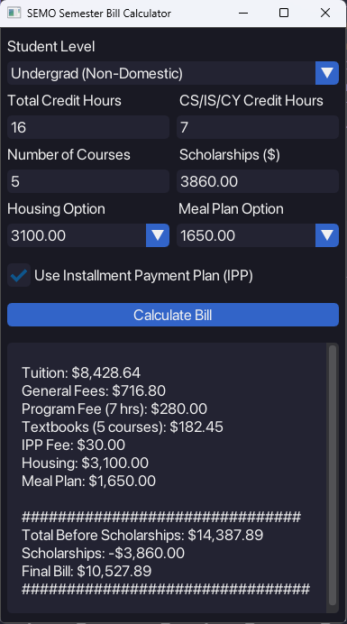

# 🎓 SEMO Semester Bill Estimator

A modern, user-friendly Python application for estimating your semester bill at Southeast Missouri State University (SEMO). For now, this feature is only available for students in the Computer Science department. Built using the GPU-accelerated [Dear PyGui](https://github.com/hoffstadt/DearPyGui), this app features a clean and intuitive UI designed to enhance usability and clarity.

---

## 🧾 Features

- 📚 Calculates tuition, general fees, and CS/IS/CY program fees
- 🏠 Includes housing and meal plan cost options
- 🎓 Supports scholarships and optional IPP (Installment Payment Plan)
- 📘 Textbook rental fee support based on course count
- 🖤 Modern dark theme with sleek styling and clean layout
- 💬 Detailed cost breakdown with emoji-enhanced feedback
- 🔧 Built with Dear PyGui (v1.10+), using a minimal and responsive interface

---

## 📷 UI Preview



---

## 🛠️ Installation

1. Clone the repo:
   ```bash
   git clone https://github.com/Hboahen42/SEMO-Semester-Bill-Estimator.git
   cd SEMO-Semester-Bill-Estimator
   ```

2. Install the required dependency:
   ```bash
   pip install dearpygui
   ```

---

## ▶️ Running the App

Make sure you’re using Python 3.8 or later.

```bash
python semo_bill.py
```

---

## 🧩 Planned Features

- 📊 Visual cost breakdown charts (bar/pie graphs)
- 🖨️ Export bill summary to PDF or CSV
- 🌗 Light/dark mode toggle
- 🗃️ Save/load bill profiles for multiple semesters

---

## 🤝 Contributing

Contributions are welcome! Feel free to fork this repository and submit a pull request. Ideas for UI improvements, bug fixes, and new features are appreciated.

---

## 📄 License

MIT License

---

## ✨ Credits

- Developed by [Humphrey Boahen](https://github.com/<your-username>)
- Built with ❤️ using [Dear PyGui](https://dearpygui.readthedocs.io)
